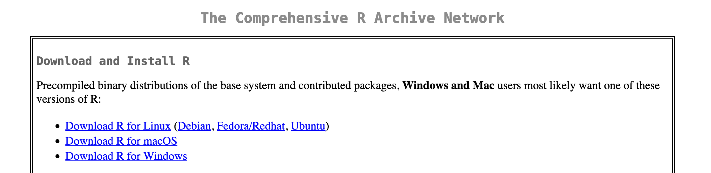
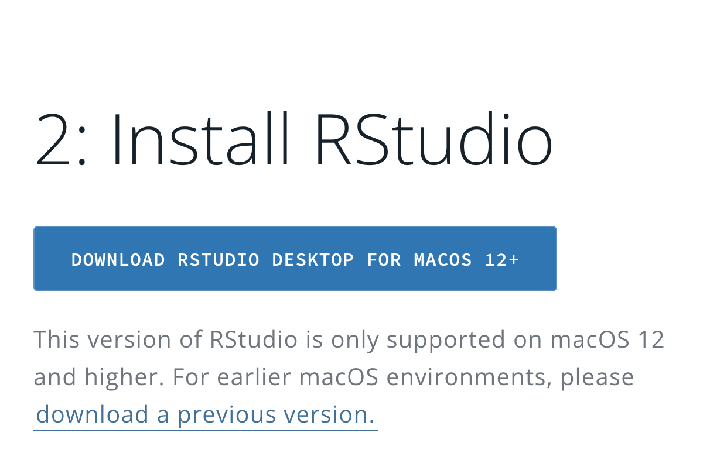
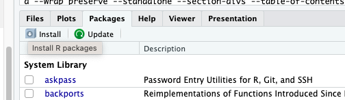
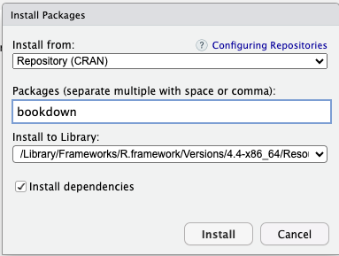
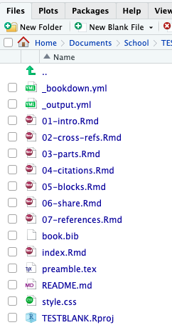

# Getting Started {#chapter2}

To get started with Bookdown you need to install R, RStudio, Bookdown, and the LaTeX distrobution of your choice if you wish to outpute as a PDF. This can be accomplished by following these steps::

1. **Install R** 
   Go to the [R Project download page](https://cran.r-project.org/) and download the latest version of R for your operating system (Windows, macOS, or Linux). Follow the installation instructions provided.

```{r, echo = FALSE}
   
```

2. **Install RStudio**:  
   Go to the [RStudio download page](https://posit.co/download/rstudio-desktop/) and select the appropriate version for your operating system. Download and follow the installation instructions.

   ```{r, echo = FALSE}
   
   ```

3. **Install Bookdown**:  
   Once RStudio is installed, install the Bookdown package by typing the following command in the RStudio console:

   ```r
   install.packages("bookdown")
   ```

   Alternatively, you can install the Bookdown package via the RStudio **Packages** pane:
   - Select **Packages** in the bottom right-hand corner of RStudio.
   
     ```{r, echo = FALSE}
     
     ```

   - Click **Install**, type `bookdown` in the **Packages** box, and click **Install**.

     ```{r, echo = FALSE}
     
     ```
4. **Install LaTeX distribution of your choice**:
The distribution you choose is entirely up to you and your needs. For a list of recommended LaTeX distributions please see [LaTeX Distributions Chapter \@ref(latexdistributions)](#latexdistributions)

To get started quickly TinyTeX is recommended as it can be installed from within RStudio by running the following code:

~~~
install.packages("tinytex")
tinytex::install_tinytex()
~~~

  Once this is complete Bookdown is now installed and you are ready to create your first Bookdown project.
  
5. **Create a New Bookdown Project in RStudio**:  
   - In RStudio, go to **File > New Project**.
   - Select **New Directory** and then **Book Project using Bookdown**.
   - Name your project and choose a location to save it to.


  Now you have a newly created Bookdown project ready to be edited to fit your needs. Bookdown comes with a base set of files so that users can get started quickly with minimal fuss. Spend a few moments to explore the files in the bottom right corner of RStudio, these are the default files Bookdown creates to get you started. It even includes sample chapters for you!

```{r, echo = FALSE}
     
```

At the end of each section is a quick exercise for you to practice on your own files.

Then when you're ready to complete your project just follow the last step below to render your book.

6. **Render Your Newly Created Book**:  
   In the **Build** pane:
   - Select **Build Book** and choose your output format, or select *All formats* to render your files as HTML, PDF, and EPUB.
   - You can also render the book directly from the R console with the following command:

   ```r
   bookdown::render_book("index.Rmd")
   ```

