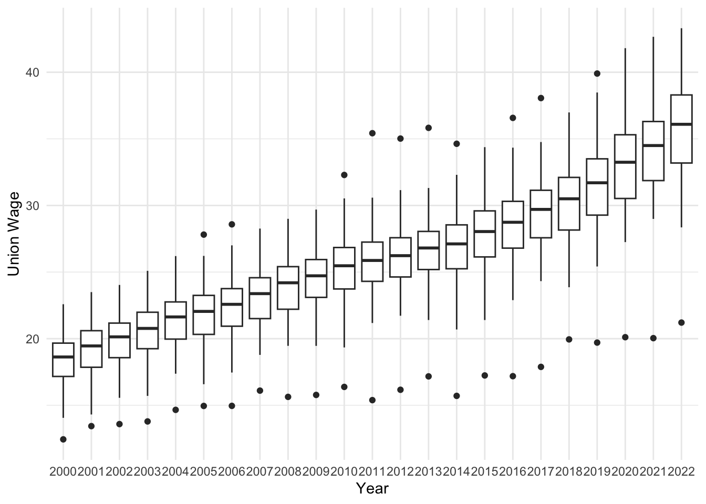

# Writing Content {#chapter3}

In this chapter, we will explore how to write and structure content in Bookdown using R Markdown syntax. Bookdown allows you to create well-organized documents by combining text, code, and references. Here, we’ll cover how to organize chapters, use Markdown and LaTeX for formatting, and format text, code chunks, and images.

---

## Creating Chapters and Sections

Each chapter in Bookdown is represented by a separate `.Rmd` file, and each `.Rmd` file should begin with a first-level heading, marked by a single `#` symbol. For example, this chapter file is `02-writing-content.Rmd` and the file starts with:

```markdown
# Writing Content
```

### Organizing Chapters
Chapters are automatically numbered based on their order in the project directory. Ensure that each file name reflects its chapter number (e.g., `02-writing-content.Rmd` for Chapter 2).

### Adding Sections and Subsections
You can add sections and subsections within a chapter using second-level and higher-level headings:

```markdown
## Section Title
### Subsection Title
```

This hierarchy organizes the document according to your needs, and these sections will automatically appear in the table of contents.

---

## Formatting Text in Bookdown

Bookdown supports a wide range of Markdown formatting. Here are a few basics:

- **Bold**: `**bold text**` → **bold text**
- *Italics*: `*italicized text*` → *italicized text*
- **Bullet Points**:
  - First item
  - Second item
- **Numbered Lists**:
  1. First item
     - Even sublists
     - Like this
  2. Second item

For additional text formatting options refer to [Chapter 9 Advanced Text Formatting](#markdown-advanced).

Use these formatting options to style text and create lists within your chapters.

---

## Adding Code Chunks

One of the strengths of Bookdown is the ability to incorporate code into your document, whether it’s R code, Markdown, LaTeX, Python, or other languages. Below are examples of how to include different types of code in your Bookdown project.

### 1. R Code

R code chunks are written between three backticks (```) with `{r}` specifying R as the language:

~~~markdown
\```{r eval=FALSE}
summary(cars)
\```
~~~

This code will display the `summary` function output of the `cars` dataset when `eval` is set to `TRUE`.

Say you are doing data-anaylsis on the Stars dataset in the `dslabs` package.

```{r eval=TRUE}
library(dslabs)
summary(stars)
```
Here we get a summary of the stars data.

### 2. Python Code

You can add Python code using `{python}` in your code chunks, and Bookdown will run the Python script and display the output.

~~~markdown
\```{python}
import numpy as np
print(np.arange(10))
\```
~~~

This example prints an array of numbers from 0 to 9 using Python.

### 3. Bash/Shell Script

For including shell commands, you can use `{bash}` as the language identifier.

~~~markdown
\```{bash}
echo "Hello, World!"
\```
~~~

This chunk will run a simple `echo` command to print "Hello, World!".

### 4. SQL Code

To add SQL queries, you can use `{sql}` for the language identifier.

~~~markdown
\```{sql, connection="your-db-connection"}
SELECT * FROM employees LIMIT 10;
\```
~~~

This SQL code retrieves the first ten rows from the `employees` table. You need to set up a database connection for this chunk to execute.

### Customizing Code Chunk Options

You can customize how code chunks appear using chunk options. Here are a few common options:

- `echo=FALSE`: Hides the code but displays the output.
- `eval=FALSE`: Shows the code but does not execute it.
- `fig.cap="Caption Text"`: Adds a caption to figures generated from the code chunk.
- `out.width="50%"`: Sets the output width for images generated in the chunk.

Example:

~~~markdown
\```{r echo=TRUE, fig.cap="A summary of the cars dataset"}
summary(cars)
\```
~~~

Experiment with these options to control how your code and output appear.

---

## Adding Images to Your Bookdown Project

Images can enhance your document by providing visual context. In Bookdown, you can add images using Markdown syntax or by embedding images using R code chunks.

### Adding Images with RStudio GGPLOT

The easiest way to add images is with the built in plotting functions of RStudio, or the ggplot package. Simply add an R code chunk and enter the code you wish to run. For example, say you you want to show a plot showing the wage increases for Union Members compared to non-Union members.

```{r message=FALSE, warning=FALSE, include=FALSE}
library(ggplot2)
library(tidyverse)
setwd("~/Documents/School/RaceIncomeCalifornia")
demographics <- readr::read_csv('demographics.csv')
wages <- readr::read_csv('wages.csv')
states <- readr::read_csv('states.csv')
filtered_wages <- wages[wages$year >= 2000, ]
filtered_states <- states[states$year >= 2000, ]
filtered_demographics <- demographics[demographics$year >= 2000, ]
merged_data <- merge(states, wages, by = "year", all.x = TRUE)
if (!requireNamespace("data.table", quietly = TRUE)) {
  install.packages("data.table")
}
library(data.table)

setDT(filtered_wages)
setDT(filtered_states)
setDT(filtered_demographics)

setDT(filtered_wages)
setDT(filtered_states)
setDT(filtered_demographics)
wage_trends <- filtered_wages[, 
      list(mean_union_wage = mean(union_wage, 
                                  na.rm = TRUE),
      mean_nonunion_wage = mean(nonunion_wage, 
                                na.rm = TRUE)), by = list(year)]
union_wage_premium <- filtered_wages[, 
      list(raw_premium = mean(union_wage_premium_raw, na.rm = TRUE),
      adjusted_premium = mean(union_wage_premium_adjusted, 
                              na.rm = TRUE)), by = year]
membership_trends <- filtered_demographics[, 
        list(average_p_members = mean(p_members, na.rm = TRUE)), by = year]
average_wage_by_year <- filtered_wages[,
      list(average_wage = (mean(union_wage, na.rm = TRUE) + 
      mean(nonunion_wage, na.rm = TRUE)) / 2), 
        by = list(year)]
merged_data$members_scaled <- merged_data$members * 100
```

```{r wagecomparison, fig.cap="Union Vs Non-Union Wages"}
ggplot(wages, aes(x = year)) +
  geom_smooth(aes(y = union_wage, color = "Union Wage"), 
              se = FALSE, method = "loess") +
  geom_smooth(aes(y = nonunion_wage, color = "Nonunion Wage"), 
              se = FALSE, method = "loess") +
  labs(x = "Year", y = "Wage",
       color = "Type of Wage") +
  theme_minimal(base_size = 14) +
  theme(legend.position = "bottom") +
  scale_color_manual(values = c("Union Wage" = "blue", "Nonunion Wage" = "green")) +
  guides(color = guide_legend(title = "Wage Type"))
```

As you can see the above code then creates a plot and places it in your document for you. This way you can fully customize the plot from within RStudio.

### Adding Images Using Markdown

To add an image using Markdown, use the following syntax:

```markdown

```

- **Alt text**: A description of the image that is useful for accessibility.
- **Path to the image**: This can be a relative path (e.g., ``) or a URL.

Example:

```markdown

```

### Adding Images Using Code Chunks

You can also add images using an R code chunk, which can be useful when the image is generated programmatically. Use the `knitr::include_graphics()` function:

```{r}

```

### Chunk Options for Images

When adding images through code chunks, you can customize their appearance using chunk options such as `fig.cap` for captions and `out.width` for sizing.

For example the following has the caption `fig.cap="An example image"` and has an output width of 25% with `out.width="25%`. As you can see the image is much smaller than allowing the output width to not be adjusted.

```{r, fig.cap="wageyear", out.width="25%"}

```
:::: {.blackbox data-latex=""}
::: {.center data-latex=""}
**EXERCISE TIME!**
:::

Create a new .Rmd file and write a short chapter that includes different types of Markdown elements (e.g., headers, lists, and images). Experiment with adding code chunks, andtext formatting.
::::
