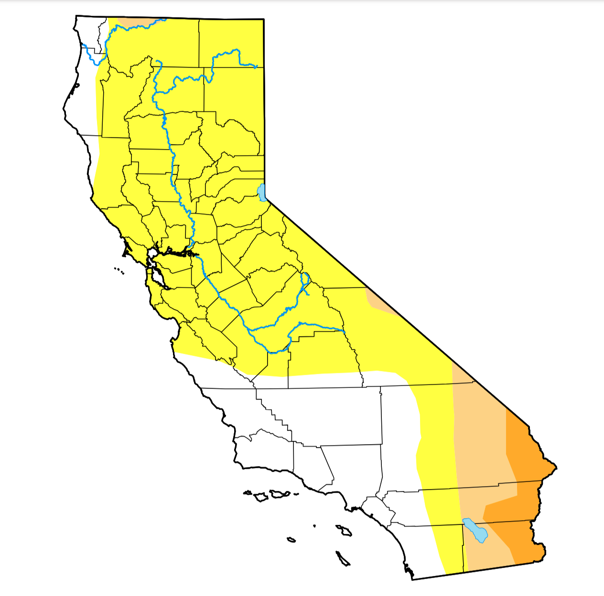

# Advanced Features and Practical Example

In this chapter, we’ll explore some advanced features of Bookdown, including adding citations, managing bibliographies, and using practical examples to illustrate how to apply these features in real projects.

## Adding Citations and Managing References

Bookdown makes it easy to manage references and add citations by using BibTeX files. Here’s how to set up and include references in your Bookdown project.

### Step 1: Create a `.bib` File

First, create a `.bib` file for your references (e.g., `references.bib`). You can add references in BibTeX format. Here’s an example entry:

```bibtex
@article{abatzoglou2016,
  title     = {Impact of anthropogenic climate change on wildfire across western US forests},
  author    = {Abatzoglou, J. T. and Williams, A. P.},
  year      = {2016},
  journal   = {Proceedings of the National Academy of Sciences},
  volume    = {113},
  number    = {42},
  pages     = {11770--11775},
  doi       = {10.1073/pnas.1607171113}
}
```

### Step 2: Link the `.bib` File in `index.Rmd`

In your `index.Rmd` file, include the `.bib` file in the YAML header:

```yaml
bibliography: [references.bib]
link-citations: yes
```

### Step 3: Cite Sources in Your Text

To cite a source, use `[@citation-key]` in your text, where `citation-key` matches the key in your `.bib` file (e.g., `[@abatzoglou2016]`). For example:

```markdown
Studies have shown the impact of climate change on wildfire intensity in western US forests [@abatzoglou2016].
```

Bookdown will automatically format your citation based on the output style.

### Step 4: Customize Citation Style (Optional)

If you need a specific citation style, you can add a `.csl` (Citation Style Language) file in your project and reference it in the YAML header:

```yaml
csl: "chicago-author-date.csl"
```

Download `.csl` files from sources like [Zotero](https://www.zotero.org/styles).

## Using Cross-References with Citations

In addition to referencing external sources, Bookdown allows you to cross-reference sections, figures, and tables, as discussed in Chapter 2. For example:

```markdown
As shown in Figure \@ref(fig:example-figure), the trend is evident.
```

Using cross-references with citations helps keep your document organized and easy to navigate.

## Practical Example: Incorporating an Existing Paper

Let’s walk through using Bookdown to incorporate an existing paper or document as part of your Bookdown project. This example will cover integrating content, images, and citations.

### Step 1: Import the Document Content

To add an existing document, start by copying sections of the text into a new `.Rmd` file, such as `05-existing-paper.Rmd`. Organize it with headings and sections as needed:

```markdown
# Example Paper: Drought in California

## Introduction

Droughts are a recurring issue in California, impacting water availability, agriculture, and the environment. Research has shown that climate change exacerbates the frequency and severity of drought events [@abatzoglou2016].

## Causes of Drought

Several factors contribute to drought conditions, including atmospheric patterns, precipitation deficits, and temperature increases.

## Socioeconomic Impacts

The economic impact of droughts can be severe, particularly in agriculture-dependent regions.
```

### Step 2: Add Figures and Tables

If your paper includes figures and tables, add them as code chunks or external images using `knitr::include_graphics()` for images:

```{r fig.cap="Example of a drought map in California", echo=FALSE}

```

For tables, use `knitr::kable()` to format data as a table:

~~~
```{r tab:drought-data, eval=FALSE, include=TRUE}
knitr::kable(head(drought_data), caption = "Drought data for California")
```
~~~
### Step 3: Integrate Citations

If the paper includes citations, ensure each citation is included in your `.bib` file and cite them using the `[@citation-key]` format as needed. For example:

```markdown
The effects of droughts on ecosystems have been widely studied [@pompeii2020].
```

### Step 4: Create a Table of Contents and Links

As your document grows, Bookdown will automatically create a table of contents for easy navigation. Use cross-references to link sections, figures, and tables within the text. For example:

```markdown
As discussed in Section \@ref(causes-drought), various factors contribute to drought conditions.
```

This will create a clickable link in HTML output, making it easier for readers to navigate.

## Example Output and Render Settings

To render the final output with all citations, cross-references, and figures, make sure the YAML header in `_output.yml` specifies the output formats you need (HTML, PDF, or EPUB). Use the following command in the R console to render all formats:

~~~
bookdown::render_book("index.Rmd", output_format = "all")
~~~

## Conclusion

In this chapter, you’ve learned how to use advanced Bookdown features like citations, cross-references, and practical examples. By integrating an existing paper, you’ve seen how Bookdown can bring together complex content with ease. You now have the tools to create a comprehensive, structured document with citations, images, tables, and references.

With these skills, you’re ready to produce high-quality documentation for academic, professional, or personal projects.
