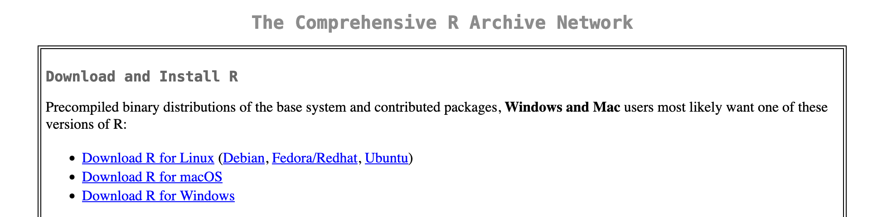
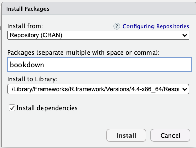

--- 
title: "Bookdown: Flexible Document Creation in RStudio"
author: "Joseph Thiers"
# date: "`r Sys.Date()`"
site: bookdown::bookdown_site
documentclass: book
bibliography: [book.bib]
# url: your book url like https://bookdown.org/yihui/bookdown
cover-image: "images/Bookcover.png"
description: |
  This tutorial demonstrates how to use the bookdown package to write structured and reproducible documents.
  The HTML output format for this example is bookdown::gitbook,
  set in the _output.yml file.
link-citations: yes
github-repo: rstudio/bookdown-demo
---

# Introduction to RStudio and Bookdown

Welcome to this **Bookdown tutorial**—a guide created to introduce students, researchers, and professionals to flexible document creation within RStudio using the `bookdown` package. Bookdown is ideal for creating single-page assignments, reports, academic papers, and even full-length books that combine text, code, and visualizations.

## Why RStudio and Bookdown?

Bookdown within RStudio supports dynamic, reproducible, and structured document creation. This is especially useful for students and professionals in mathematics where equations, figures, and analysis are integral to the work. While tools like LaTeX, Microsoft Word, or PowerPoint each have their strengths, Bookdown brings the unique ability to integrate text, code, data analysis, and figures in one streamlined, reproducible workflow.

## What You’ll Learn in This Tutorial

This tutorial covers the essential aspects of using Bookdown:

* **Chapter 1**: Setting Up Bookdown – Installing the package and configuring a Bookdown project in RStudio.
* **Chapter 2**: Writing and Structuring Content – Using R Markdown syntax to create chapters, add code chunks, cross-references, and other essentials.
* **Chapter 3**: Customizing Output – Exporting your book in HTML, PDF, or EPUB, along with tips on styling and configuration.
* **Chapter 4**: Advanced Features and Practical Example – Integrating citations, managing references, and a full walkthrough using a real paper example.

## Getting Started

To get started with this tutorial, please follow these steps:

1. **Install R**:  
   Go to the [R Project download page](https://cran.r-project.org/) and download the latest version of R for your operating system (Windows, macOS, or Linux). Follow the installation instructions provided.

   ```{r, echo = FALSE}
   
   ```

2. **Install RStudio**:  
   Go to the [RStudio download page](https://posit.co/download/rstudio-desktop/) and select the appropriate version for your operating system. Download and follow the installation instructions.

   ```{r, echo = FALSE}
   knitr::include_graphics("images/tutorialscreenshots/installRStudio.png")
   ```

3. **Install Bookdown**:  
   Once RStudio is installed, install the Bookdown package by typing the following command in the RStudio console:

   ```r
   install.packages("bookdown")
   ```

   Alternatively, you can install the Bookdown package via the RStudio **Packages** pane:
   - Select **Packages** in the bottom right-hand corner of RStudio.
   
     ```{r, echo = FALSE}
     knitr::include_graphics("images/tutorialscreenshots/installPackage.png")
     ```

   - Click **Install**, type `bookdown` in the **Packages** box, and click **Install**.

     ```{r, echo = FALSE}
     
     ```

4. **Create a New Bookdown Project in RStudio**:  
   - In RStudio, go to **File > New Project**.
   - Select **New Directory** and then **Book Project using Bookdown**.
   - Name your project and choose a location to save it.

5. **Render Your Newly Created Book**:  
   In the **Build** pane:
   - Select **Build Book** and choose your output format, or select *All formats* to render your files as HTML, PDF, and EPUB.
   - You can also render the book directly from the R console with the following command:

   ```r
   bookdown::render_book("index.Rmd")
   ```
